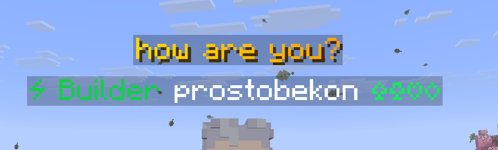
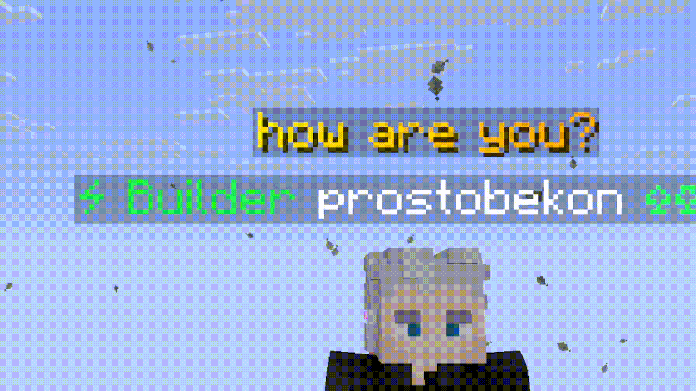

# 💬 ChatOverhead

A lightweight Paper plugin that displays player messages above their
heads.

## 🌧 Other README
- [README Russian](https://github.com/24na7/ChatOverhead/blob/main/docs/readme/ru/README_RU.md)

## ✨ Features

-   **Head-Attached Messages** - Messages stay attached to the player's
    head
-   **Smooth Animations** - Previous messages smoothly move upward
-   **Multi-Line Support** - Animation height adapts to message length
-   **MiniMessage Support** - Gradients and text formatting
-   **Configurable** - Display time, height, message length and more
-   **Player Allowlist** - Choose who can use overhead chat

## 📸 Screenshots





## ⚙️ Configuration

``` yaml
lang: en_us.yml

settings:
  text-height: 2.4
  display-seconds: 8
  max-text-length: 50
  use-minimessage: true

allowed-players:
  - []
```

## 🛠️ Commands

``` text
/chatoverhead add <player>
/chatoverhead remove <player>
/chatoverhead list
/chatoverhead reload
```

## 🌍 Languages

Included:

-   🇷🇺 Russian
-   🇺🇸 English

Custom languages can be added through `lang/`.

------------------------------------------------------------------------
